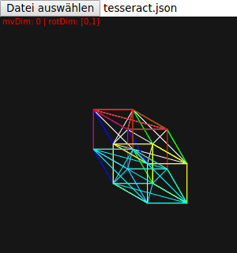
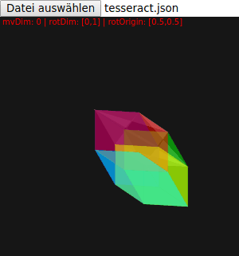
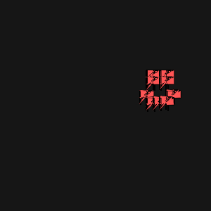

# nDrender #

A simple yet fully functional n-D renderer.
---
nDrender simply does what you want from it and nohing more or less.
Write a .json file that contains all the coordinates for all the verticies of
your shape and connect these verticies with faces inside your .json file.
After you have successfully created a n-Dimensional object, simply load it
with the nDrenderer written by my, Luca Leon Happel and see the magic happen.

This project aims to create a very simple n-dimensional object&vertex&face viewer.
Simplicity and ease of use are the top priority (after getting the engine to work.
So, if you plan to visualize your data in n-Dimensions or you just want to create
a fun n-Dimensional game, this library is for you. A wiki is soon to come.

Important key bindings are:

**Key**|**Action**
:-----:|:-----:
a|move negative to the current move dimension
d|move positive to the current move dimension
w|change the move dimension to a higher dimension
s|change the move dimension to a lower dimension
h|rotate negative to the currently selected rotation dimensions
l|rotate positive to the currently selected rotation dimensions
u|move to a higher first rotation dimension
j|move to a lower first rotation dimension
i|move to a higher second rotation dimension
k|move to a lower second rotation dimension
y|toggle wireframe
x|toggle drawing faces
c|decrease face opacity
v|increase face opacity
r|increase rotation x-origin
f|decrease rotation x-origin
t|increase rotation y-origin
g|decrease rotation y-origin
